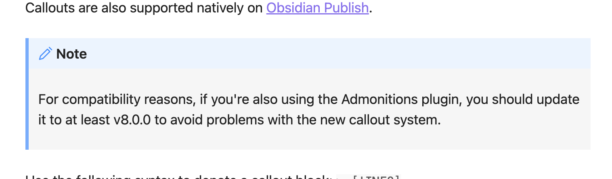
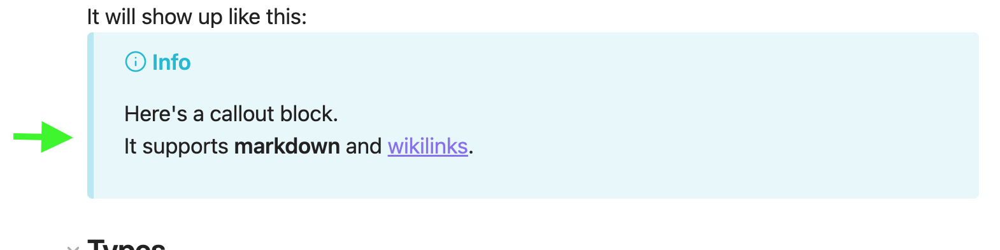
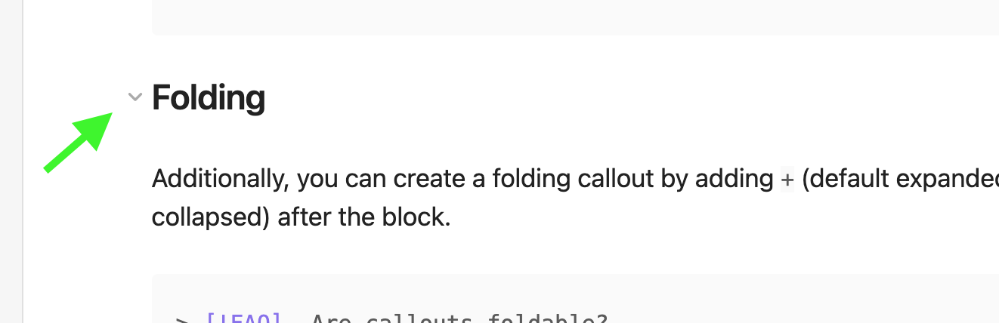
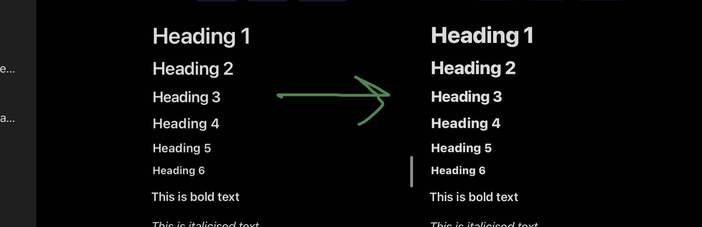

# Obsidian Snippets

Just some simple CSS snippets for customising the appearance of Obsidian.

Install by dropping files into your Obsidian [snippets folder](https://help.obsidian.md/How+to/Add+custom+styles).

## 1. callout-restore-all.css

Obsidian 1.0 changed callouts in three ways:

1. Left-hand border removed
2. Grey callout body took the same colour as its header
3. Header text no longer black

This snippet restores the whole old appearance.

## 2. callout-restore-border.css

Restore only the left-hand border of callouts to their pre-1.0 appearance.

This accent colour gives callouts enhanced definition.

## 3. collapse-visible.css

In Obsidian, elements like headers and bullet list items can fold to collapse.
Default behaviour is to only show the collapse arrow on hover.
This has two negative consequences:
1. Difficult to use on mobile.
2. Reduced inclination to collapse.

This CSS makes the arrows permanently visible.

## 4. header-colours.css

A few pastel colours for header text in dark mode.

## 5. header-weight-heavier.css

Increase each header text weight to 800, making for stronger, bolder headers.

